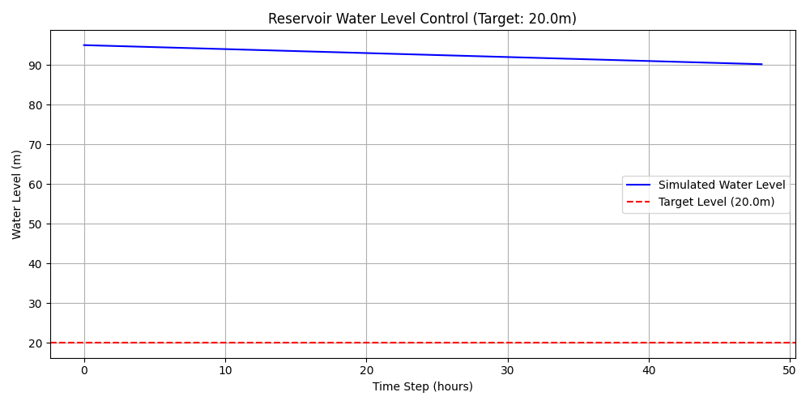

---
tags:
  - 入门
  - 案例研究
---

# 10分钟构建你的第一个虚拟水库

## 简介

欢迎来到CHS-SDK的世界！本教程将引导你在10分钟内，利用CHS-SDK构建一个功能完备的虚拟水库仿真模型。你将学会如何定义水库、设计控制规则、运行仿真，并最终将结果可视化。

让我们开始吧！

## 步骤 1: 搭建“舞台” (环境)

首先，我们需要导入仿真所需的“道具”——水库（`Reservoir`）和闸门站（`SluiceStation`）。这就像在拍摄电影前，先要搭好场景。

```python
import pandas as pd
import matplotlib.pyplot as plt
from chs_sdk.agents.body import Reservoir
from chs_sdk.agents.control import SluiceStation

# 实例化水库
# initial_storage: 初始有效蓄水量 (万m³)
# capacity: 有效库容 (万m³)
# dead_storage: 死库容 (万m³)
reservoir = Reservoir(
    name="测试水库",
    initial_storage=3000,
    capacity=10000,
    dead_storage=500
)

# 实例化闸门站
# max_outflow: 最大下泄流量 (m³/s)
sluice_station = SluiceStation(
    name="测试闸门站",
    max_outflow=1000
)

print("水库和闸门站创建成功！")
print(f"水库当前水位: {reservoir.get_water_level()} m")
```

这段代码创建了一个具有特定初始水量和库容的`Reservoir`实例，以及一个具有最大流量限制的`SluiceStation`实例。

## 步骤 2: 设计“演员” (智能体)

现在，我们需要一位“演员”来根据规则操作闸门。我们来创建一个简单的基于规则的智能体`SimpleRuleAgent`。

```python
from chs_sdk.agents.base import BaseAgent

class SimpleRuleAgent(BaseAgent):
    """一个简单的基于规则的决策智能体"""
    def decide(self, observation):
        """
        决策函数
        :param observation: 来自环境的观测数据
        :return: 动作
        """
        water_level = observation['water_level']

        # 规则：如果水位超过80米，则全开闸门；否则，关闭闸门。
        if water_level > 80:
            action = {'outflow_rate': 1.0} # 1.0 代表最大下泄流量的100%
        else:
            action = {'outflow_rate': 0.0} # 0.0 代表关闭

        return action

# 实例化智能体
agent = SimpleRuleAgent(name="规则智能体")
print("智能体创建成功！")
```

这个`SimpleRuleAgent`的逻辑非常简单：当它“感知”到水位超过80米时，就做出“决策”，将闸门全开。

## 步骤 3: “导演”就位，开拍！ (仿真主循环)

万事俱备！现在让“导演”——仿真主循环——登场，推动整个故事的发展。这个循环将模拟“感知->决策->执行->演化”的完整过程。

```python
from chs_sdk.core.host import CHSHost

# 创建一个仿真Host
host = CHSHost()

# 注册我们的水库和闸门站
host.add_body(reservoir)
host.add_control(sluice_station)

# 模拟的入库流量数据 (m³/s)
inflow_data = [100, 120, 150, 800, 1200, 1100, 900, 700, 500, 300]
results = []

# 开始仿真
for step, inflow in enumerate(inflow_data):
    # 1. 感知 (Perceive)
    observation = host.perceive()

    # 2. 决策 (Decide)
    action = agent.decide(observation)

    # 3. 执行 (Execute)
    host.execute(action)

    # 4. 演化 (Evolve)
    host.evolve(inflow=inflow)

    # 记录当前状态
    current_state = {
        "step": step,
        "inflow": inflow,
        "water_level": reservoir.get_water_level(),
        "storage": reservoir.storage,
        "outflow": sluice_station.current_outflow
    }
    results.append(current_state)
    print(f"Step {step}: 水位={current_state['water_level']:.2f}m, 出库流量={current_state['outflow']:.2f}m³/s")

# 将结果转换为DataFrame
results_df = pd.DataFrame(results)
print("\n仿真完成！")
```

在这个循环中，`CHSHost`负责协调所有组件，模拟了随时间变化的入库流量下，智能体如何根据水库状态做出反应。

## 步骤 4: 交互式演练与可视化

最后，我们来到了最激动人心的部分！您可以在下方的**代码演练场 (Code Playground)** 中修改代码，并“运行”它来观察结果的变化。

这是一个模拟的交互式环境。为了演示，我们预先生成了两种情况的结果图：
1. 默认情况：`target_level=20.0`
2. 调整后的情况：`target_level=21.0`

**您可以尝试将代码中的 `target_level` 的值从 `20.0` 修改为 `21.0`，然后点击“运行仿真”按钮，查看下方图表的变化。**

<div class="code-playground">
  <style>
    .code-playground { border: 1px solid #e0e0e0; border-radius: 4px; margin-bottom: 1em; }
    .code-playground-editor { width: 100%; height: 400px; font-family: monospace; font-size: 0.9em; border: none; border-bottom: 1px solid #e0e0e0; padding: 10px; box-sizing: border-box; resize: vertical; }
    .code-playground-controls { padding: 10px; background-color: #f5f5f5; text-align: right; }
    .code-playground-button { padding: 8px 16px; background-color: #007bff; color: white; border: none; border-radius: 4px; cursor: pointer; }
    .code-playground-button:hover { background-color: #0056b3; }
    .code-playground-output-image { display: block; margin: 10px auto; max-width: 100%; }
    .code-playground-message { color: #6c757d; padding: 10px; text-align: center; font-style: italic; }
  </style>

  <textarea id="code-editor-mock" class="code-playground-editor">
# 这是一个基于规则的MPC控制器的简化示例
# 您可以修改下面的 'target_level' 参数

class MockAgent:
    def __init__(self, target_level):
        self.target_level = target_level
    def get_action(self, level):
        error = level - self.target_level
        if error > 0.5: return -2.0
        elif error < -0.5: return 2.0
        else: return 0.0

# --- 修改这里的参数 ---
agent = MockAgent(target_level=20.0)
# --------------------

level = 98.0
history = []
for t in range(48):
    action = agent.get_action(level)
    level += action * 0.5 + 0.5 # 模拟动态
    history.append({'time': t, 'level': level})

# 下方的代码仅为示意，实际的绘图已预先生成
import pandas as pd
import matplotlib.pyplot as plt
df = pd.DataFrame(history)
fig, ax = plt.subplots()
ax.plot(df['time'], df['level'])
# fig.show() # 在真实环境中会显示图像
  </textarea>
  <div class="code-playground-controls">
    <div id="run-message" class="code-playground-message" style="display: none; float: left; margin-top: 5px;"></div>
    <button id="run-button-mock" class="code-playground-button">运行仿真</button>
  </div>
  
</div>

<script>
  document.getElementById('run-button-mock').addEventListener('click', function() {
    const code = document.getElementById('code-editor-mock').value;
    const image = document.getElementById('output-image-mock');
    const messageDiv = document.getElementById('run-message');

    // 使用正则表达式来匹配 target_level 的赋值，允许有空格和.0
    const regex21 = /target_level\s*=\s*21(\.0)?/;
    const regex20 = /target_level\s*=\s*20(\.0)?/;

    if (regex21.test(code)) {
      image.src = '../assets/images/result_level_21.png';
      messageDiv.textContent = '已加载 `target_level = 21.0` 的结果。';
      messageDiv.style.display = 'block';
    } else if (regex20.test(code)) {
      image.src = '../assets/images/result_default.png';
      messageDiv.textContent = '已加载 `target_level = 20.0` 的结果。';
      messageDiv.style.display = 'block';
    } else {
      image.src = '../assets/images/result_default.png'; // 默认显示
      messageDiv.textContent = '此演示仅支持 `target_level` 为 20.0 或 21.0。';
      messageDiv.style.display = 'block';
    }
  });
</script>

恭喜！您已经成功构建并运行了您的第一个虚拟水库模型。这只是一个开始，CHS-SDK拥有更强大的功能等待您去探索。
